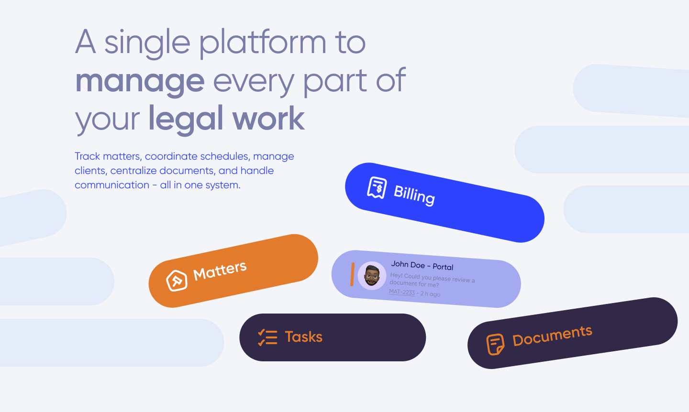

# Praava Legal Landing Page

Live: https://abhi1202803.github.io/praavalegal.com-R1/

## Preview



## About

This is my Round 1 assignment submission for the Legal Work Platform landing page. The page is built to match the given design with a split layout, large heading, floating module cards, responsive behavior, animations, and light/dark theme support.

## Tech Stack

- Next.js 14
- React
- TypeScript
- CSS
- lucide-react
- GitHub Pages

## Features

- Responsive landing page layout
- Floating cards for Billing, Matters, Tasks, Documents, and Portal
- Reusable card component with color, icon, label, and rotation props
- Light and dark mode switch
- Hover effects on floating cards
- Smooth entrance and floating animations
- Mobile-friendly stacked layout
- Static deployment using GitHub Actions

## Run Locally

```bash
npm install
npm run dev
```

Open `http://localhost:3000`.

## Build

```bash
npm run build
```
